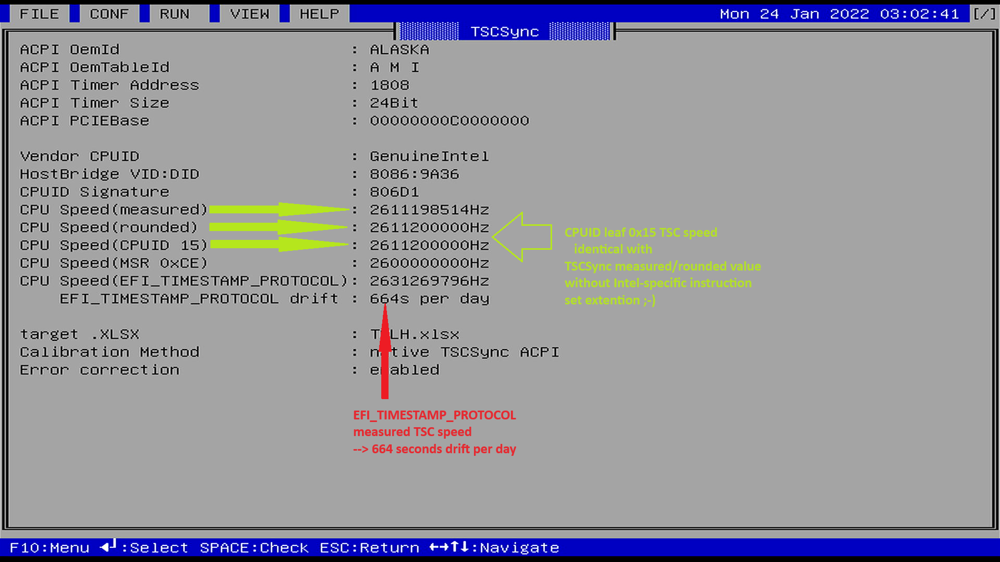
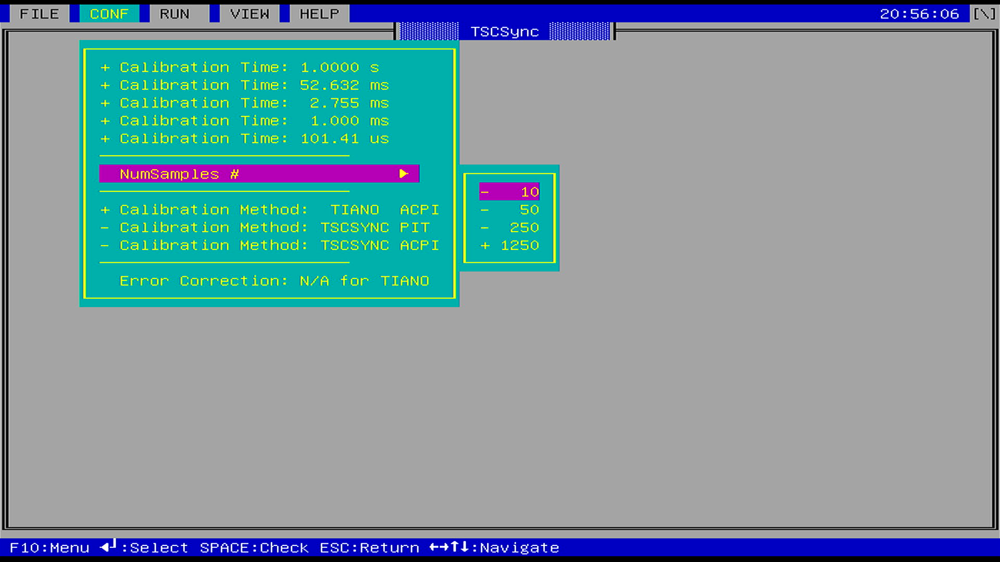
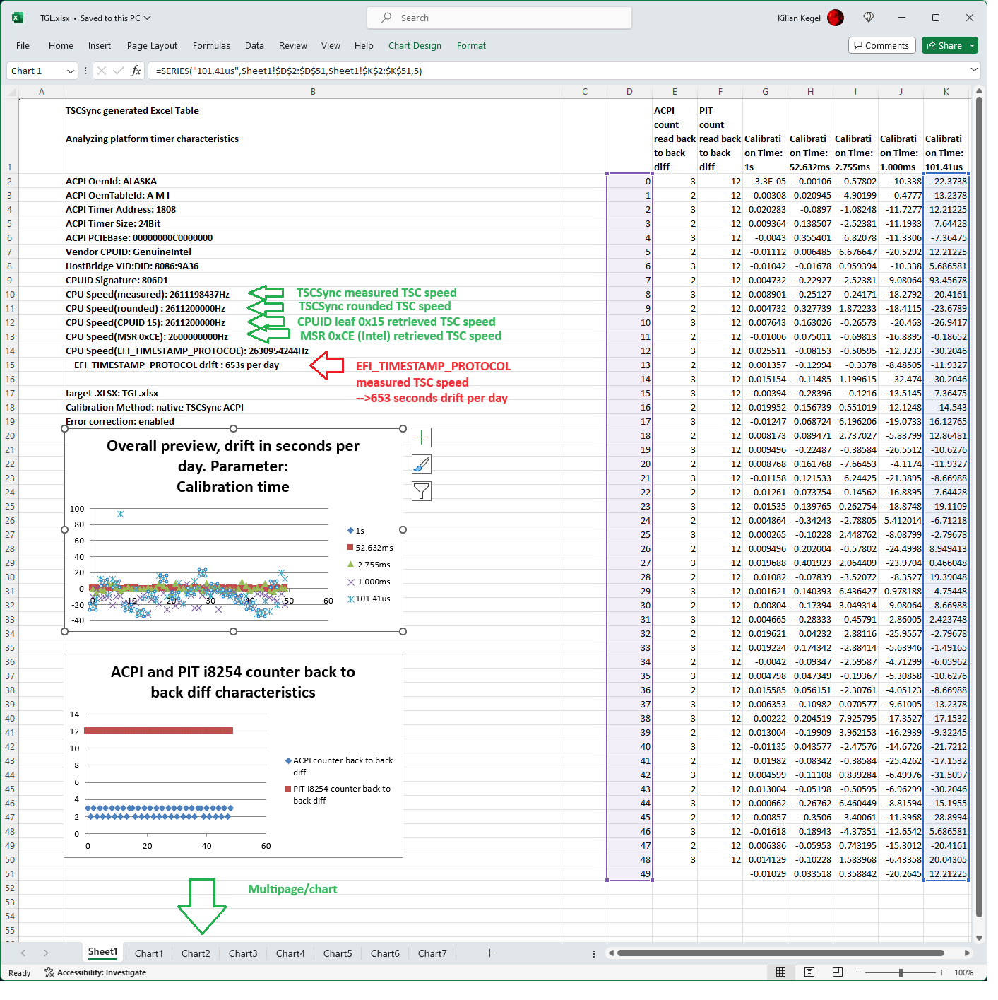

# Visual-TSCSync-for-UEFI-Shell
TSCSync - TimeStampCounter (TSC) synchronizer,  analyze System Timer characteristics

## Intention
Explore timer characteristics on current UEFI Personal Computer (PC) hardware.

Analyse usability and accuracy of 64Bit TSC (time stamp counter) as
a time base in UEFI BIOS POST and UEFI SHELL Applications.

## Goal
Provide program sequence, synchronisation method and basic 
knowledge on how to deal with the fastes, and most precise timer
on x86-Microprocessors.

## Approach
Create an UEFI Shell Tool **TSCSync** that makes it easy to select, modify
and scale data processing, logging, representation for this particular laboratory
application.

## Howto
### Menu driven configuration
Just watch the video: https://www.youtube.com/watch?v=I92emFEyTDI

### AUTORUN configuration
**NOTE:** **/AUTORUN** mode usually runs a predefined and saved configuration.
This mode was made available to enable repeated .NSH/batch controlled
**TSCSync** invocation with modified settings, like
* calibration **/METHOD**
	* **TIANO**, original *tianocore* `InternalAcpiDelay()`
	* **ACPI**, native **TSCSYNC** ACPI counter
	* **PIT**, native **TSCSYNC** PIT i8254 counter
* output filename **/OUT**
* modified reference synchronisation time **/SYNCTIME** 1..1000
* modified reference synchronisation device **/SYNCREF**
	* **RTC**
	* **ACPI**

Just watch the video: https://www.youtube.com/watch?v=hjeykqZqekc&t=27s

## Revision history
### 20231105
* improvement, *BETA RELEASE*
* add **Calibration Method** for *PIT(i8254)* and *original tianocore* to CONFig menu 
  NOTE: the third method "ACPI" (that is my own calibration based on ACPI timer) can be selected via command line only
### 20231028
* improvement, *BETA RELEASE*
* add **/METHOD:TIANO/ACPI/PIT** to select ACPI/PIT(i8254) or original *tianocore* calibration method
* CONFIG Menu shows true timing values, instead of ACPI clock numbers
### 20231015
* initial revision, *ALPHA RELEASE*
