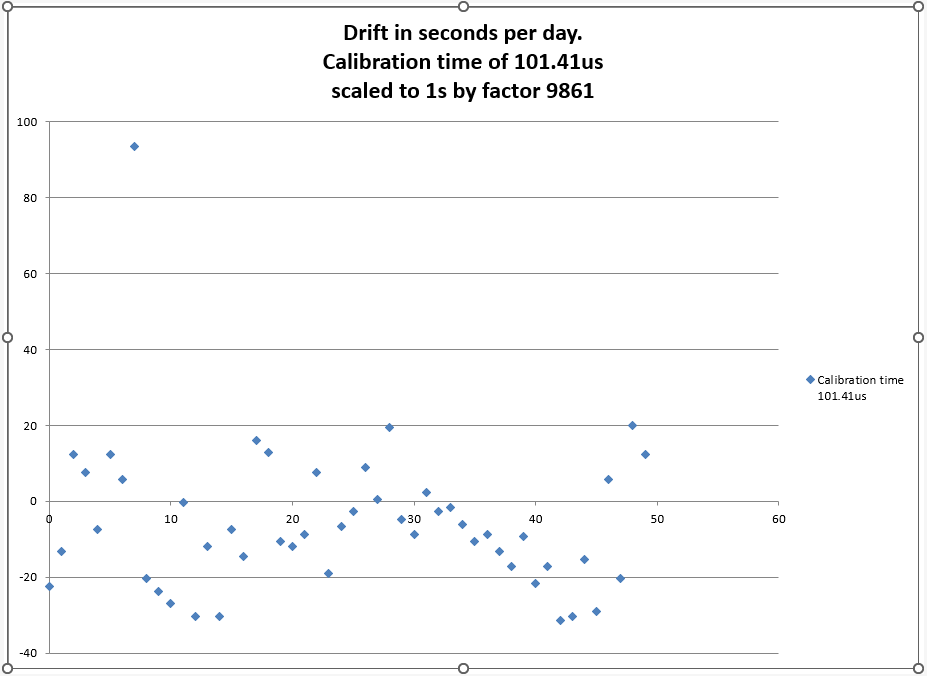

# Visual-TSCSync-for-UEFI-Shell
TSCSync - TimeStampCounter (TSC) synchronizer,  analyze System Timer characteristics

## Intention
Explore timer characteristics on current UEFI Personal Computer (PC) hardware.

Analyse usability and accuracy of 64Bit TSC (time stamp counter) as
a time base in UEFI BIOS POST and UEFI SHELL Applications.

## Goal
Provide program sequence, synchronisation method and basic 
knowledge on how to deal with the fastes, and most precise timer
on x86-Microprocessors.

## Approach
Create an UEFI Shell Tool **TSCSync** that makes it easy to select, modify
and scale data processing, logging, representation for this particular laboratory
application.

## Howto
### Menu driven configuration
Just watch the video: https://www.youtube.com/watch?v=I92emFEyTDI

### Binary
[TSCSync.EFI](x64/EFIApp/TSCSync.efi)

### AUTORUN configuration
**NOTE:** **/AUTORUN** mode usually runs a predefined and saved configuration.
This mode was made available to enable repeated .NSH/batch controlled
**TSCSync** invocation with modified settings, like
* calibration **/METHOD**
	* **TIANO**, original *tianocore* `InternalAcpiDelay()`
	* **ACPI**, native **TSCSYNC** ACPI counter
	* **PIT**, native **TSCSYNC** PIT i8254 counter
* output filename **/OUT**
* modified reference synchronisation time **/SYNCTIME** 1..1000
* modified reference synchronisation device **/SYNCREF**
	* **RTC**
	* **ACPI**

Just watch the video: https://www.youtube.com/watch?v=hjeykqZqekc&t=27s

## Revision history
### 20250727, v1.3.2 Build 89
* update to [**toro C Library v0.9.4 Build 672**](https://github.com/KilianKegel/Visual-TORO-C-LIBRARY-for-UEFI)
* update to [**Visual-LIBXLSXWRITER-for-UEFI-Shell 20250726**](https://github.com/KilianKegel/Visual-LIBXLSXWRITER-for-UEFI-Shell)
### 20250412, v1.3.2 Build 82
* update to [**toro C Library v0.9.1 Build 267**](https://github.com/KilianKegel/Visual-TORO-C-LIBRARY-for-UEFI)
### 20240406, v1.3.1 Build 79
* distinguish RTC and ACPI based frequency detection
	* NOTE: ACPI frequency lacks precision as long term time base
		- RTC usually uses a separate 32.768kHz crystal with low drift (e.g. 2ppm)
		- CPU/SoC (ACPI) OSC is usually driven by a MHz-oscillator (e.g. 25MHz) that doesn't have high precision and low drift requirements as the REAL TIME CLOCK
### 20240401, v1.3.0 Build 50
* add **AMI APTIO V** UEFI timestamp protocol calibration drift demonstration:
	* **RUN->Run DRIFT TEST**, to start the demo
    
### 20240316, v1.2.4 Build 10
* add feature:
	* **FILE->SoftOFF/S5**, set platform to SoftOFF/S5
### 20240113, v1.2.3 Build 8
* add 10000kHz digit rounding, e.g.
	* **1995379567** is rounded to **1995380000**
	* **1995371234** is rounded to **1995370000**
### 20240106, v1.2.2 Build 5
* fixed: fix rounding issue for X.YZ9999999GHz values
* provide .EFI executable [TSCSync.EFI](x64/EFIApp/TSCSync.efi)
* internal: update submodules
* internal: cleanup main.cpp
### 20240101, v1.2.0 Build 2
* add TSC clock speed rounding (experimental), get identical result like **CPUID leaf 0x15**-enabled platforms
* simplify command line parameters -> remove selection of SYNCREF (synchronization reference device), SYNCTIME (synchronization time)
	* force SYNCREF ACPI timer, force SYNCTIME 5 seconds
* add version + build enumeration (experimental) 
### 20231210
* add retrieval of [**Time Stamp Counter and Core Crystal Clock Information Leaf**](https://www.intel.com/content/dam/develop/external/us/en/documents/architecture-instruction-set-extensions-programming-reference.pdf#page=34)
	* NOTE: On platforms with available **CPUID leaf 0x15** (Intel CPU 2017 and later) it demonstrates, that ACPI reference synchronisation is very accurate (about 0.1ppm)
* add retrieval of **MSR_PLATFORM_INFO** TSC Speed detection
* add reference [spreadsheet](https://github.com/KilianKegel/Visual-TSCSync-for-UEFI-Shell/blob/main/RTL.xlsx) taken on RAPTOR LAKE platform
NOTE: Improvements below apply only to recent INTEL(tm) platforms only. The particular CPUID leaf 0x15 and MSR **MSR_PLATFORM_INFO** are not available on AMD systems.
### 20231202
* add retrieval, examination and comparison of original **UEFI** **`EFI_TIMESTAMP_PROTOCOL`** 
  NOTE: **`EFI_TIMESTAMP_PROTOCOL`** provides inaccurate results on most systems.
### 20231119
* add error correction menu `CONF\Error Correction` and command line (`/ERRCODIS`) selectable
	* NOTE: Error correction N/A for original TIANOCORE (TIANO) measurement method 
	  Only available for **TSCSYNC** ACPI and PIT.
* add calibration method menu `CONF\Calibration Method TIANO/PIT/ACPI` and command line (`/METHOD`)  selectable
* add number of measurement command line (`/NUM:0/1/2/3`)  selectable
* update to TORO C Library 20231118
### 20231105
* improvement, *BETA RELEASE*
* add **Calibration Method** for *PIT(i8254)* and *original tianocore* to CONFig menu 
  NOTE: the third method "ACPI" (that is my own calibration based on ACPI timer) can be selected via command line only
### 20231028
* improvement, *BETA RELEASE*
* add **/METHOD:TIANO/ACPI/PIT** to select ACPI/PIT(i8254) or original *tianocore* calibration method
* CONFIG Menu shows true timing values, instead of ACPI clock numbers
### 20231015
* initial revision, *ALPHA RELEASE*
